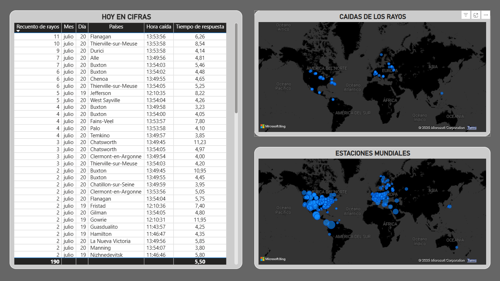
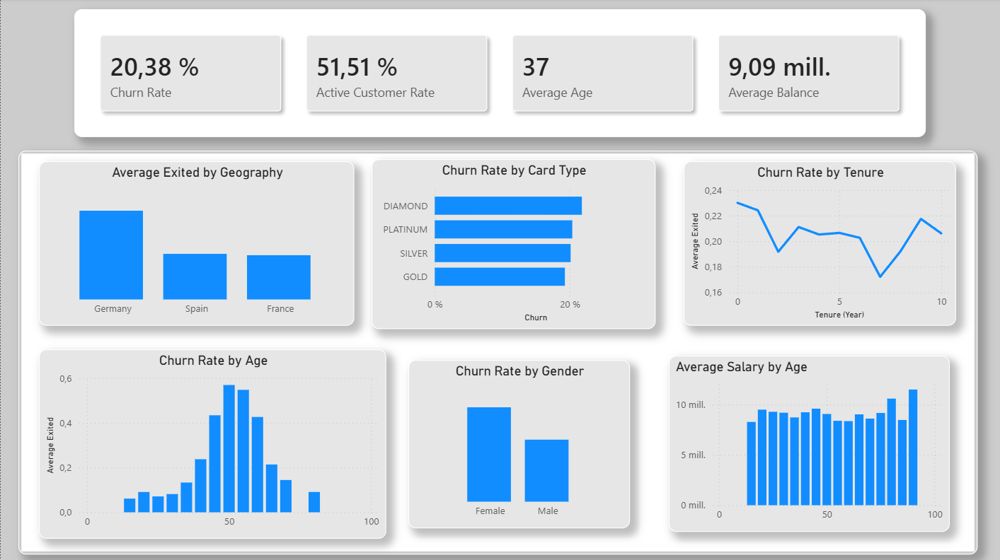

<h1 align="center">Álvaro Martínez Flores</h1>

<h3 align="center">
Data Analyst · Business Intelligence · Python · SQL · Power BI
</h3>

<p align="center">
Los datos permiten entender una situación, medir resultados y encontrar oportunidades de mejora.
Durante mis prácticas en Calconut aprendí que su valor no está solo en visualizarlos, sino en asegurar su fiabilidad y convertirlos en información útil para la toma de decisiones.
</p>

<p align="center">
Trabajar con Power BI y distintos departamentos reforzó mi interés por seguir desarrollándome profesionalmente en Data Analytics y Business Intelligence.
</p>

<br>

<p align="center">

  <a href="mailto:alvaromarflo@gmail.com">
    
  </a>

  <a href="https://www.linkedin.com/in/varomf/">
    
  </a>

  <a href="https://alvaromf02.github.io/">
    
  </a>

</p>

---

# About Me

```python
class AlvaroMartinez:

    def __init__(self):
        self.role = "Data Analyst & Business Intelligence"

        self.skills = [
            "Data Analysis",
            "Power BI",
            "SQL",
            "Python",
            "ETL & Data Cleaning",
            "Data Visualization",
            "Machine Learning"
        ]

        self.interests = [
            "Business Intelligence",
            "Data Automation",
            "Dashboard Development",
            "Data Modeling",
            "Analytics"
        ]

    def goal(self):
        return "Transforming data into useful information for better decisions."
````

---

# Tech Stack

<p align="center">
  
</p>

<p align="center">


</p>

---

# Featured Projects

<table>
<tr>

<td width="50%">

## ⚡ StrikeWatch



Sistema de análisis y visualización de rayos en tiempo real utilizando datos recibidos mediante WebSockets.

Incluye procesamiento y limpieza de datos, almacenamiento en MySQL y visualización mediante Power BI.

**Tech Stack**
Python · MySQL · Power BI · WebSockets · ETL

<br>

<a href="LINK_REPOSITORIO_STRIKEWATCH">
  
</a>

</td>

<td width="50%">

## 👥 Customer Churn Analysis



Proyecto de análisis de clientes orientado a identificar patrones relacionados con el abandono y desarrollar modelos predictivos.

Incluye EDA, limpieza de datos, ingeniería de variables y comparación de diferentes modelos de Machine Learning.

**Tech Stack**
Python · Pandas · Scikit-learn · XGBoost · EDA

<br>

<a href="LINK_REPOSITORIO_CHURN">
  
</a>

</td>

</tr>

<tr>

<td width="50%">

## ☕ Coffee Shop BI


Proyecto de Business Intelligence basado en una base de datos de ventas con más de 300.000 registros.

Incluye modelado de datos, SQL, medidas DAX y desarrollo de un informe completo en Power BI.

**Tech Stack**
Power BI · SQL · MySQL · DAX · Data Modeling

<br>

<a href="LINK_REPOSITORIO_COFFEESHOP">
  
</a>

</td>

<td width="50%">

## 🚗 PredictCar


Modelo de Machine Learning orientado a predecir el precio de vehículos a partir de diferentes características.

Se compararon distintos algoritmos como Random Forest, Decision Tree y XGBoost.

**Tech Stack**
Python · Scikit-learn · XGBoost · Pandas · Machine Learning

<br>

<a href="LINK_REPOSITORIO_PREDICTCAR">
  
</a>

</td>

</tr>

</table>

---

# Current Focus

* Data Analysis
* Business Intelligence
* Power BI & DAX
* SQL & Data Modeling
* ETL & Data Cleaning
* Automation
* Data Visualization
* Machine Learning aplicado a negocio

---

# Education

**Máster en Data Analysis e IA**
Evolve · 2026

**Especialización en Inteligencia Artificial y Big Data**
DIGITECH Málaga · 2025

**Desarrollo de Aplicaciones Web**
IES Mar de Alborán · 2024

---

# Connect With Me

<p align="center">

<a href="mailto:alvaromarflo@gamil.com">
  
</a>

<a href="https://www.linkedin.com/in/varomf/">
  
</a>

<a href="https://alvaromf02.github.io/">
  
</a>

</p>

---

<p align="center">
<i>"Convirtiendo datos en información útil para entender, decidir y mejorar."</i>
</p>
